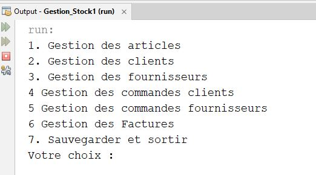
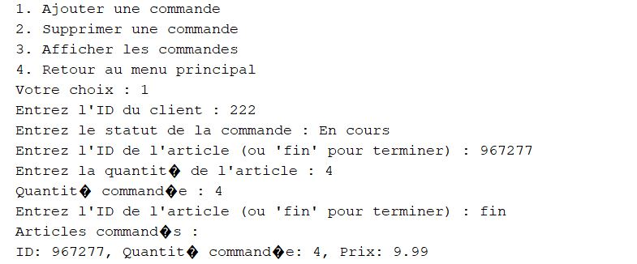
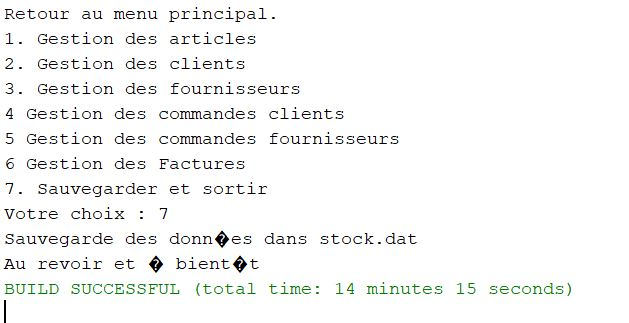
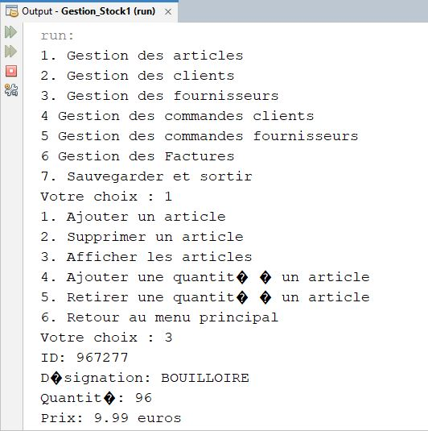

# Application de Gestion de Stock - Java POO

Projet réalisé dans le cadre du module de Programmation Orientée Objet.

## 🎯 Objectif
Créer une application console en Java permettant de gérer :
- Les clients
- Les fournisseurs
- Les articles
- Les commandes
- La facturation

## 🛠️ Technologies utilisées
- Java
- Collections (HashMap, HashSet)
- Sérialisation
- Interface console
- NetBeans


## 🧪 Tester l'application


### 🔧 Prérequis
- Java JDK installé (version 8 ou supérieure)
- (Optionnel) IDE comme **NetBeans** ou **IntelliJ**

### ▶️ Lancer avec NetBeans
1. Ouvrir le projet dans NetBeans (`Gestion_Stock1`)
2. Exécuter la classe `Gestion_Stock1.java` (clic droit → Exécuter)

L'application s'ouvre dans le terminal et affiche un menu :
Gestion des articles

Gestion des clients

Gestion des fournisseurs

### 💻 Lancer depuis un terminal (ligne de commande)

1. Ouvrir un terminal dans le dossier du projet
2. Compiler tous les fichiers :
```bash
javac -d bin Gestion_Stock1/src/gestion_stock1/*.java

Exécuter l'application

java -cp bin gestion_stock1.Gestion_Stock1
```
## 🛒 Processus d'une commande client

Ce processus montre comment un client peut passer une commande, générer une facture et observer l'impact sur le stock.

### Étapes du processus :

1. **Création de la commande** :
   - L'utilisateur sélectionne "Gestion des commandes clients".
   - Il choisit d'ajouter une commande.
   - Il entre l'ID du client et le statut de la commande.

2. **Ajout d'articles** :
   - L'utilisateur saisit les ID des articles à commander ainsi que les quantités souhaitées.
   - La commande est enregistrée avec les détails fournis.

3. **Génération de la facture** :
   - Une fois la commande enregistrée, une facture est automatiquement générée.

4. **Mise à jour du stock** :
   - Les quantités des articles sont mises à jour selon la commande passée.

### Résultat de l'exécution :


*Création de la commande avec sélection du client et ajout d’articles.*


*Génération de la commande et de la facture, avec mise à jour automatique du stock.*

## 💡 Information importante

> ⚠️ **À noter** : Pour que les commandes créées soient effectivement prises en compte (affichées et que le stock soit mis à jour), il est **impératif de sélectionner l'option 7 : _Sauvegarder et sortir_** dans le menu principal.

Cela déclenche l'enregistrement des données, ce qui permet de :
- sauvegarder les commandes passées,
- générer les factures associées,
- et **décrémenter les quantités en stock** en fonction des articles commandés.



### de base j'avais une quantite 100 pour cet article la quantite en stock a bien été modifié après la commande passée  :

